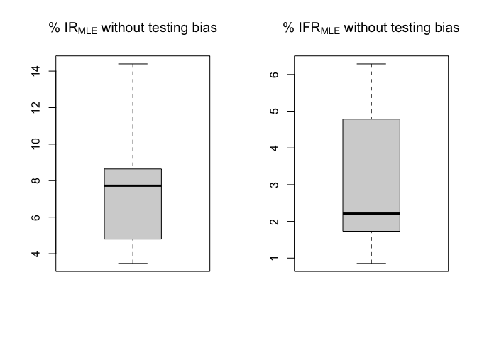
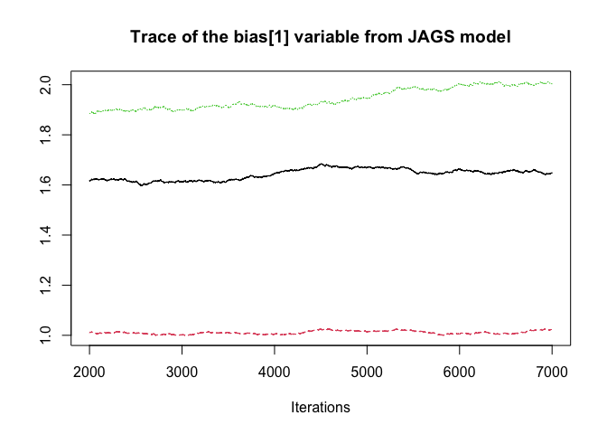
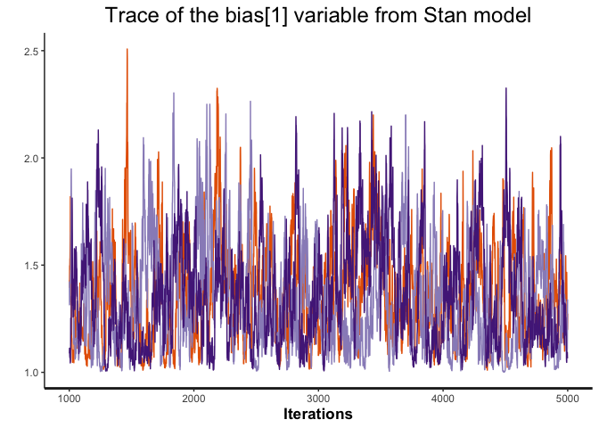
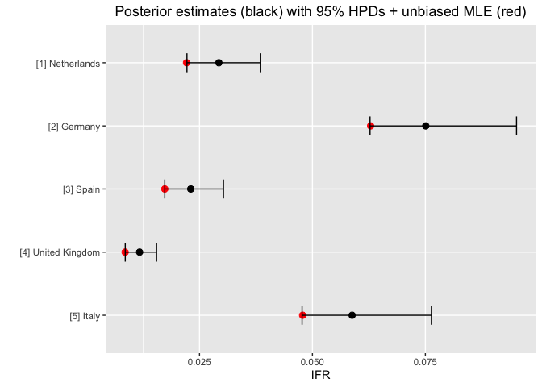
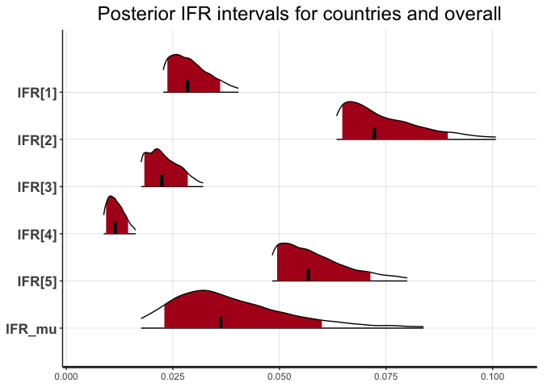

# Effect of testing bias on the estimation of the Infection Fatality Rate

Biased (preferential) testing refers to the increased odds in getting tested as an infected subject against getting tested as a non-infected subject. This can lead to overestimation of the infected population and hence the underestimation of the Infection Fatality Rate (IFR). Using Bayesian prior on the testing bias, this project attempts to illustrate this effect based on current data from selected countries.

---

Capstone project in the context of the course [Bayesian Statistics: Techniques and Models](https://www.coursera.org/learn/mcmc-bayesian-statistics) by the University of California: Santa Cruz hosted on Coursera.

---

### Executive Summary

Infected individuals are more likely to be tested than non-infected ones. This phenomenon is described as biased (or preferential) testing, which leads to biased estimates of the number of infected people in a population, which in turn leads to a biased estimate of the Infection Fatality Rate (IFR). This project attempts to illustrate this effect using Bayesian statistics and data from selected countries. The result is an estimate of the uncertainty introduced by the testing bias.

### Introduction

A commonly used and misleading metric for describing the risk of dying from a COVID-19 infection is the Case Fatality Rate (CFR), which is given by the ratio of deaths to confirmed cases $CFR=D/CC$. This metric obviously does not take into account that the true number of cases may be much higher. A better suited metric is the Infection Fatality Rate (IFR), which is the ratio of the number of deaths to actual cases $IFR=D/C$. However, the challenge is that the true number of cases $C$ is not recorded and hard to estimate, especially due to biased testing. In this context, biased (preferential) testing means that symptomatic cases are more likely to be tested than non-symptomatic cases. This makes the ratio of confirmed cases against the number of tests $CC/T$ likely to overestimate the number of cases in the population. Using data from selected countries at a late state in the pandemic (October 2020 at time of writing), the goal of this project is to obtain up-to-date estimates on the $IFR=D/IR*P$ based on the observed variables P, T, CC, D under the strong assumption of biased testing.

### Data

The data used in this project is from *Our World in Data* [1]. Specifically, the data for all confirmed cases and deaths described [here](https://github.com/owid/covid-19-data/tree/master/public/data) [2] is used to obtain values for all selected countries and observed variables. The countries were selected based on prior knowledge on the reliability of the reported data and prior knowledge on the degree of preferential testing. The Python script *owid.py* downloads the most current data and performs the following steps:

1) Only columns are retained that are relevant to the stated problem
2) Only selected countries are retained for which data is available
3) For each country only the most current data is retained

This leaves us with the following data set:

    ## # A tibble: 5 × 6
    ##   iso_code location       population total_tests total_cases total_deaths
    ##   <chr>    <chr>               <dbl>       <dbl>       <dbl>        <dbl>
    ## 1 ESP      Spain            46745211    72847345     6294745        89405
    ## 2 GBR      United Kingdom   68207114   368855703    12774849       148534
    ## 3 DEU      Germany          83900471    93337884     7208790       112161
    ## 4 NLD      Netherlands      17173094    22433872     3229270        21104
    ## 5 ITA      Italy            60367471   145453492     6975465       138474

For demonstration purposes let's assume unbiased testing for this section. MLE point estimates for both the IR and IFR are then straightforward to obtain. To be clear, when assuming unbiased testing we interpret the tests as a perfectly random and representative sample from the overall population, without bias toward positive or negative cases. Since in reality, this is very likely not the case [3][4][5], these estimates are not very accurate. Using $IR_{MLE}=CC/T$ we assume $C_{MLE}=P*IR_{MLE}$ cases in the population and a infection fatality rate of $IFR_{MLE} = D/C_{MLE}$.

### Model
The base frame for the model follows the paper *Bayesian adjustment for preferential testing in estimating infection fatality rates, as motivated by the COVID-19 pandemic* [3], which assumes binomial distributions for both deaths $D$ and confirmed cases $CC$ in country $k$. Accordingly, the number of deaths $D_k$ in population $P_k$ follows the binomial distribution $D_k \mid IFR_k \sim Bin(IFR_k,C_k)$, with the sought after probability of a death following an infection. Since $C_k$, the true number of infections in the population is unknown but we know that $C_k$ itself follows the binomial distribution $C\mid IR_k \sim(IR_k,P_k)$, this can be simplified to $D_k \mid IFR_k,IR_k \sim Bin(IFR_k*IR_k,P_k)$ by marginalizing out $C_k$ [6]. The number of positive cases $CC_k$ following $T_k$ tests follows the binomial distribution $CC_k \mid IR_k,bias_k\sim Bin(\theta_k,T_k)$. Using $g$ to denote the $logit$ function, the relationship between the probability of being tested positively $\theta_k$ is related to the true infection rate and a testing bias as $g(\theta_k)=g(IR_k)+bias_k$. Accordingly, the data likelihoods can be written as follows:

$$
\begin{align*}
D_k \mid IFR_k,IR_k &\sim Bin(IFR_k * IR_k, P_k) \\
CC_k \mid IR_k, bias_k &\sim Bin(\theta_k, T_k) \\
g(\theta_k)&=g(IR_k)+bias_k \\
\end{align*}
$$

The main idea behind the testing bias is that it models the odds of a positive case being tested against a negative case being tested. This was directly inspired by the article *Upper-Bounds and Testing Biases For the Number of SARS-COVID-19 Infections* [4]. Using Bayes Theorem, we can express the relationship between the bias, the odds of being infected and the odds of being tested positively. For example: If positive cases are twice as likely to be tested as negative tests the bias is $bias=log(2)\approx0.7$. If both positive and negative cases are equally likely to be tested $bias=log(1)=0$.

$$
\begin{align*}
bias&=log\frac{P(tested \mid infected)}{P(tested \mid \neg infected)}\\
log\frac{P(infected \mid tested)}{P(\neg infected \mid tested)}&=log\frac{P(infected)}{P(\neg infected}) + bias\\
logit(P(infected \mid tested)) &= logit(P(infected)) + bias \\
g(\theta_k)&=g(IR_k)+bias \\
\end{align*}
$$

Choices for the prior probabilities for $IFR$ and $IR$ follow the approach in [3]. Since the infection and fatality rates are caused by the same disease and hence are likely to share information, hierarchical priors are used to model expected fatality and infection rates across countries with normal distributions $g(IFR_k) \sim N(\mu_{IFR},\sigma_{IFR})$ and $g(IR_k) \sim N(\mu_{IR},\sigma_{IR})$. Since the infection rate is much more likely to vary between countries than the fatality rate, $\sigma_{IFR} \sim Half-N(0,0.001)$ and $\sigma_{IFR} \sim Half-N(0,1)$. Finally, non-informative priors are used for the key parameters $g^{-1}(\mu_{IFR})$ and $g^{-1}(\mu_{IR})$ $\sim U(0,1)$. The prior for the bias was selected to reflect the odds-ratio described above. With $\exp(bias) \sim Half-N(1,0.4^2)$ the bias is ensured to be non-negative and a priori the bias is assumed in $[1,2]$ (with >95% of the prior probability mass) with lower biases being more likely. The full model can be written as follows:

$$
\begin{align*}
D_k \mid IFR_k,IR_k &\sim Bin(IFR_k * IR_k, P_k) \\
CC_k \mid IR_k, bias_k &\sim Bin(\theta_k, T_k) \\
g(\theta_k)&=g(IR_k) + bias_k\\
g(IFR_k) &\sim N(\mu_{IFR},\sigma_{IFR})\\
g(IR_k) &\sim N(\mu_{IR},\sigma_{IR})\\
\exp(bias_k) &\sim Half-N(1,0.4^2) \\
g^{-1}(\mu_{IFR}) &\sim U(0,1)\\
g^{-1}(\mu_{IR}) &\sim U(0,1)\\
\sigma_{IFR} &\sim Half-N(0,0.001) \\
\sigma_{IR} &\sim Half-N(0,1) \\
k &\in \{countries\}
\end{align*}
$$

#### Identifiability and convergence
Due to the decision to model the testing bias as a redundant intercept in $g(\theta_k)=g(IR)+bias$, special care is needed with the choice of sampling method and priors. With improper uniform priors for both $IR_k$ and $bias$ the probability density would be the same for any $q$ that is added to $IR_k + q$ and subtracted from $bias_k - q$ (additive invariance). This would show as an "infinite" ridge in the posterior distribution for $p(IR_k, bias_k \mid \mathbf{y})$. By adding proper priors we can make sure that there is finite area for which the density is higher [7]. Despite proper priors Metropolis-Hastings and Gibbs sampling based methods as used in JAGS struggle to explore the posterior properly. Hamiltonian Monte Carlo on the other hand as used by Stan can lead to the desired results [8]. The same model was implemented in both JAGS and Stan to illustrate this. Both models were run with 3 separate chains for 20000 (5000 for Stan) iterations and burn-in of 1000. It is found that JAGS is not able to explore the posterior properly with scale reduction factors for the bias variable up to $\approx 3.31$ and effective sample sizes (ESS) as low as $\approx 15$ and high autocorrelation. The Stan model produces reasonable convergence metrics with ESS $> 2000$ and low autocorrelation $< 0.5$ at lag 1. The output of the Stan model was used in the results section.

### Results

The results are easiest interpretable when compared to the MLE estimates without adjustments for testing biases. The expectation is that the the posterior mean IFR for each country $IFR_k \mid \mathbf{y}$ is estimated higher than from the MLE estimates due to the additional bias term $bias \ge 0$. Logically the more testing bias there is, the lower we estimate the (true) number of infected people and the higher the IFR. Due to the prior choice $\exp(bias) \sim Half-N(1,0.4^2)$ and the resulting range of possible values $bias \in [0, \infty]$ the lower bound of the posteriors is expected to contain the MLE estimate, whereas the upper bound can be interpreted as the additional uncertainty due to preferential testing. We can validate this by comparing the HPD for each country and compare it to the MLE values. For all countries we observe that the lower HPDs cover the MLE estimate.

    ## ci_level: 0.8 (80% intervals)

    ## outer_level: 0.95 (95% intervals)

    ## # A tibble: 5 × 5
    ##   location       IFR_MLE_unbiased IFR_mean IFR_lower IFR_upper
    ##   <chr>                     <dbl>    <dbl>     <dbl>     <dbl>
    ## 1 Spain                   0.0221    0.0293   0.0222     0.0385
    ## 2 United Kingdom          0.0629    0.0751   0.0628     0.0952
    ## 3 Germany                 0.0173    0.0231   0.0173     0.0303
    ## 4 Netherlands             0.00854   0.0117   0.00856    0.0155
    ## 5 Italy                   0.0478    0.0588   0.0477     0.0763

### Conclusion

Estimating the true Infection Mortality Rate (IFR) is an ambiguous task due to plethora of reasons and can not be the goal of this project. This project merely tries to shine a light on the effect of preferential testing and the resulting underestimation of the IFR and its confidence bounds. The next time a number on the IFR appears in the media or sciences, this may help interpretation with regards to how the data was obtained and what adjustments were made to incorporate preferential testing. The uncertainty due to the testing bias not only makes the estimation of IFR much harder, but also may pose serious implications for policy makers. This once again emphasizes the value of reliable data.

The prior choices for $bias_k$ play an important role and are subject to targeted research on the testing practices in the individual countries of interest. However, even with the naive choice of $\exp(bias_k) \sim N(1,0.4^2)$ this example illustrates that under the assumption of low but existing testing bias the expected IFR may be higher than assumed (on average $\approx 20 - 30$%).

### Shortcomings

**Identifiability and choice of prior**

The unidentifiability of the model due to the choice of modeling the bias as a redundant intercept leads to a strong dependence on the choice of the prior. The resulting posteriors with heavy tails toward higher values are a direct result of the chosen half-normal distribution for the bias. Any other choice of prior leads to drastically different results (!). 

**Better informed priors**

If reliable data was available on the degree of preferential testing, a more data-driven approach in quantifying the bias, $\frac{P(tested \mid infected)}{P(tested \mid \neg infected)}$ may help the identifiability of the model and a more reliable estimate of the IFR. Accordingly, additional research on the testing practices in countries of interest might enable more accurate choice of prior. As an example, we might find out that in country $i$ infected individuals are on average twice as likely to be tested than non-infected ones and we impose $\exp(bias_i) \sim N(2,0.01^2)$.

**Covariates**

Estimating the IFR or even the CFR is not meaningful without including covariates. Most importantly, it is well known that the IFR drastically changes depending on the age and previous health record of a subject, but also information related to a countries health care system and even the current dynamic of the disease itself (time) are all crucial factors [1][3].

### References

[1] [Our World in Data](https://ourworldindata.org/)

[2] [Data on COVID-19 by Our World in Data](https://github.com/owid/covid-19-data/tree/master/public/data)

[3] [Bayesian adjustment for preferential testing
in estimating infection fatality rates, as
motivated by the COVID-19 pandemic](https://arxiv.org/pdf/2005.08459.pdf)

[4] [Upper-Bounds and Testing Biases For the Number of SARS-COVID-19 Infections](https://towardsdatascience.com/upper-bounds-and-testing-biases-for-the-number-of-sars-covid-19-infections-66ff3eaa5be7)

[5] [Stan User Guide: Problematic Posteriors due to redundant intercepts](https://mc-stan.org/docs/2_25/stan-users-guide/collinearity-section.html)

[6] [Conditional binomials](https://en.wikipedia.org/wiki/Binomial_distribution#Conditional_binomials)

[7] [Collinearity of Predictors in Regressions](https://mc-stan.org/docs/2_25/stan-users-guide/collinearity-section.html)

[8] [Sampling Difficulties with Problematic Priors](https://mc-stan.org/docs/2_25/stan-users-guide/sampling-difficulties-with-problematic-priors.html)